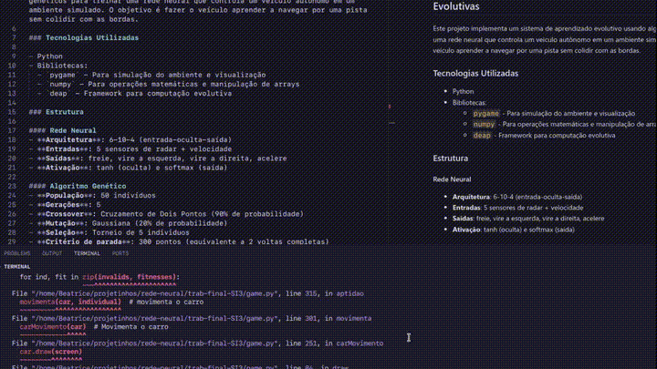
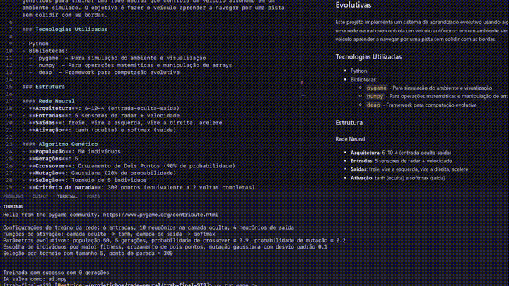

# Trabalho Final de Sistemas Inteligentes 3


## Sistema de Controle de Veículos Autônomos com Redes Neurais Evolutivas

Este projeto implementa um sistema de aprendizado evolutivo usando algoritmos genéticos para treinar uma rede neural que controla um veículo autônomo em um ambiente simulado. O objetivo é fazer o veículo aprender a navegar por uma pista sem colidir com as bordas.

### Tecnologias Utilizadas

- Python
- Bibliotecas:
  - `pygame` - Para simulação do ambiente e visualização
  - `numpy` - Para operações matemáticas e manipulação de arrays
  - `deap` - Framework para computação evolutiva

### Estrutura

#### Rede Neural
- **Arquitetura**: 6-10-4 (entrada-oculta-saída)
- **Entradas**: 5 sensores de radar + velocidade
- **Saídas**: freie, vire a esquerda, vire a direita, acelere
- **Ativação**: tanh (oculta) e softmax (saída)

#### Algoritmo Genético
- **População**: 50 indivíduos
- **Gerações**: 5
- **Crossover**: Cruzamento de Dois Pontos (90% de probabilidade)
- **Mutação**: Gaussiana (20% de probabilidade)
- **Seleção**: Torneio de 5 individuos
- **Critério de parada**: 300 pontos (equivalente a 2 voltas completas)

### Funcionamento

O sistema irá:
1. Tentar carregar uma IA já treinada (`ai.npy`)
2. Caso não encontre, iniciará o treinamento automaticamente
3. Após o treinamento, salvará o primeiro modelo a atingir o critério de parada alvo em `ai.npy`
<br><br><br>

<br><br>


### Estrutura do Projeto

```
├── assets/        # Imagens do carro e mapa
└── game.py        # Código principal
```
---